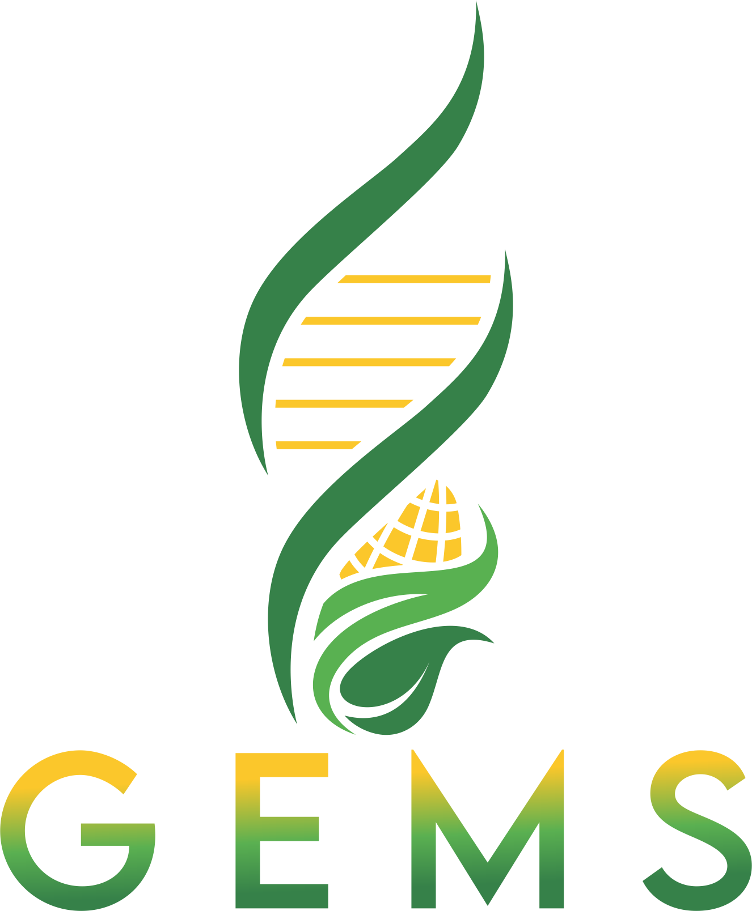

# GEMSFertilizer 

<!-- badges -->
[](https://github.com/seu_usuario/GEMSFertilizer/actions/workflows/R-CMD-check.yaml)
[](https://www.gnu.org/licenses/gpl-3.0)
[](https://www.r-project.org/)

> **Sistema interativo de recomendação de adubação mineral, calagem e gessagem para culturas agrícolas**

Baseado no **Manual de Adubação e Calagem para Minas Gerais — 5ª Aproximação (2023)** e no **Manual de Recomendações de Adubação e Calagem do Estado de Sergipe (EMBRAPA)**.

---

## Instalação

```r
# Instalar o pacote remotes se necessário
if (!requireNamespace("remotes", quietly = TRUE))
  install.packages("remotes")

# Instalar o GEMSFertilizer direto do GitHub
remotes::install_github("seu_usuario/GEMSFertilizer")
```

## Uso

```r
# Iniciar o aplicativo
GEMSFertilizer::run_app()

# Verificar versão
GEMSFertilizer::gems_version()

# Rodar em porta específica (útil em servidores ou laboratórios)
GEMSFertilizer::run_app(host = "0.0.0.0", port = 3838)
```

---

## Funcionalidades

### 🌱 Culturas suportadas
| Cultura | Espécie |
|---|---|
| Milho | *Zea mays* |
| Feijão | *Phaseolus vulgaris* |
| Cana-de-açúcar | *Saccharum* spp. |
| Arroz | *Oryza sativa* |
| Mandioca | *Manihot esculenta* |
| Amendoim | *Arachis hypogaea* |
| Sorgo | *Sorghum bicolor* |
| Pastagem | *Brachiaria* spp. |
| Abacaxi | *Ananas comosus* |

### 📐 Calagem — 3 métodos
- **Saturação por Bases V%** — padrão da 5ª Aproximação de MG
- **Neutralização de Al³⁺ + Ca+Mg** — amplamente usado no Nordeste
- **Tampão SMP** — método indireto
- Comparação simultânea dos 3 métodos

### 🪨 Gessagem — métodos clássico e atualizado
- **Textura do solo** (Sousa & Lobato, 2004) — culturas anuais e perenes
- **V% subsolo** (Demattê/Vitti, 2008)
- **Saturação por Ca²⁺ na CTCef** (Caires & Guimarães, 2018) ⭐ mais preciso

### 💰 Módulo financeiro
- Comparativo de custo entre 16 fontes comerciais de N, P₂O₅ e K₂O
- Identificação automática do produto mais barato por nutriente
- Tabela editável de preços com busca opcional via **CEPEA/AgroLink**
- Persistência local dos preços atualizados

### 🔬 Modo Pesquisa (exclusivo para pesquisa agrícola)
Converte doses ha⁻¹ para unidades experimentais:
- Metro linear de sulco
- Por planta
- Cova / berço
- Vaso / lisímetro (com fator de escala por volume)
- Parcela (m²)

Gera tabela de **gradiente de tratamentos** (% da dose de referência) com doses por ha, por metro linear e por cova — pronto para montagem do delineamento experimental.

### 📊 Gráficos interativos (Plotly)
- **Radar de fertilidade** — visão geral de 7 parâmetros normalizados
- **Macronutrientes** — barras com nível ótimo de referência
- **Gauges V% e m%** — indicadores de saturação com alvo por cultura
- **Micronutrientes** — % relativo ao nível ótimo (B, Cu, Fe, Mn, Zn)

---

## Análise de solo — parâmetros aceitos

### Obrigatórios (camada 0–20 cm)
`pH (H₂O)`, `M.O. (dag kg⁻¹)`, `P-Mehlich (mg dm⁻³)`, `K⁺ (mg dm⁻³)`,
`Ca²⁺`, `Mg²⁺`, `Al³⁺`, `(H+Al)` em `cmolc dm⁻³`, `Argila (%)`

### Opcionais
`S-SO₄²⁻`, `B`, `Cu-DTPA`, `Fe-DTPA`, `Mn-DTPA`, `Zn-DTPA` em `mg dm⁻³`

### Subsolo 20–40 cm (para gessagem Caires & Guimarães)
`Ca²⁺`, `Mg²⁺`, `Al³⁺`, `K⁺`

---

## Referências técnicas

1. **Ribeiro, A.C.; Guimarães, P.T.G.; Alvarez V., V.H. (Eds.)** — *Recomendações para uso de corretivos e fertilizantes em Minas Gerais: 5ª Aproximação.* CFSEMG, Viçosa, 1999/2023.

2. **EMBRAPA / UFS** — *Manual de Recomendações de Adubação e Calagem para o Estado de Sergipe.* Aracaju, SE.

3. **Caires, E.F.; Guimarães, M.F. (2018)** — Nova metodologia para cálculo de gessagem baseada na saturação por Ca²⁺ na CTCef da camada 20–40 cm.

4. **Sousa, D.M.G.; Lobato, E. (2004)** — *Cerrado: Correção do Solo e Adubação.* EMBRAPA Cerrados, Planaltina.

---

## Estrutura do pacote

```
GEMSFertilizer/
├── R/
│   └── run_app.R          # Funções exportadas: run_app(), gems_version()
├── inst/
│   └── app/               # Aplicativo Shiny completo
│       ├── app.R
│       ├── data/           # Tabelas técnicas, cálculos, módulo de preços
│       ├── ui/             # Interface (ui_main.R, ui_helpers.R)
│       └── server/         # Lógica do servidor
├── man/                    # Documentação Rd
├── DESCRIPTION
├── NAMESPACE
└── .github/workflows/      # R CMD CHECK automatizado
```

---

## Contribuindo

Contribuições são bem-vindas! Por favor:

1. Faça um fork do repositório
2. Crie um branch para sua feature (`git checkout -b feature/nova-cultura`)
3. Commit suas mudanças (`git commit -m 'Add: cultura do café'`)
4. Push para o branch (`git push origin feature/nova-cultura`)
5. Abra um Pull Request

---

## Licença

GPL (>= 3) — veja [LICENSE](LICENSE) para detalhes.

---

## Aviso

> Este aplicativo é uma **ferramenta de apoio técnico e orientativo**. As recomendações devem ser validadas por um **Engenheiro Agrônomo** habilitado, considerando condições locais específicas não contempladas pelo sistema.
